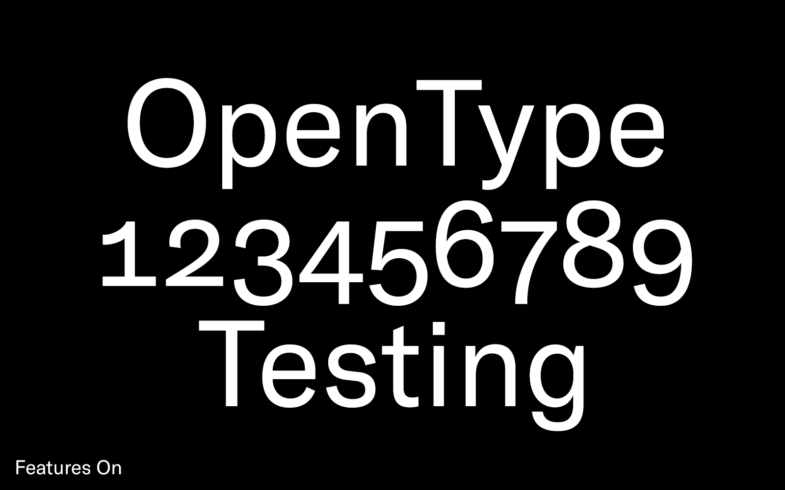
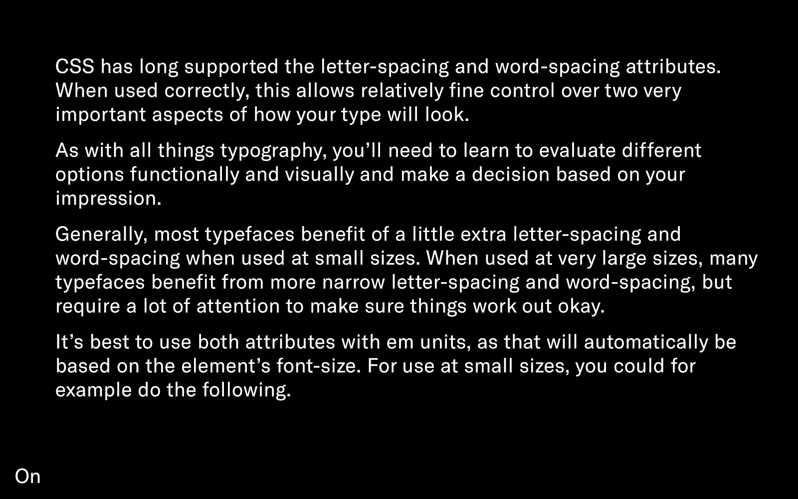

# Using (Grilli Type) web fonts

**This document is a work in progress, an initial draft, and not ready for public consumption. If you’re here it’s because I sent you a link for feedback. Please do not share this further. Thank you!**

Luckily it is really easy to use custom fonts in websites nowadays. The basics are easy to master, and this document hopes to help with that. 

It also links to further, more in-depth sources that are helpful for more advanced developers aiming to perfect aspects like the loading of the font files.

## Still to be added

* CSS font-weight & font-style: when to put it into @font-face definition and when not, pros / cons.
* When to use -webkit-font-smoothing: subpixel-antialiased, rendering in different browsers / devices & CSS anti-aliasing (and why not to use text-rendering property)
* Also: Basic info on hinting
* Base64 encoding in the advanced section (problems w/ caching)
* Add resources like copypastecharacter.com. What other resources?
* Common troubleshooting steps: checking path (console), do web fonts load in all browsers, is font-family name under 28 chars to ensure <IE11 support?
* Hyphenation? Maybe too far

## Table of contents

* [Web font formats](#web-font-formats)
* [How to embed web fonts in HTML/CSS](#how-to-embed-web-fonts-in-csshtml)
	* [CSS for all formats](#css-for-all-formats)  
	* [CSS for modern formats](#css-for-modern-formats)  
	* [HTML embed code](#html-embed-code)
* [Advanced Typographic Features](#advanced-typographic-features)
	* [Spacing and kerning](#spacing-and-kerning)
	* [Advanced OpenType features](#advanced-opentype-features)
  * [Letter-spacing and word-spacing](#letter-spacing-and-word-spacing)
* [Even more](#even-more)
	* [Uploading our font files to Github](#uploading-our-font-files-to-github)
	* [Loading web fonts](#loading-web-fonts)
	* [CSS Text Decoration](#css-text-decoration)
* [Comments? Additions? Feedback?](#comments-additions-feedback)

## Web font formats:

When you purchase Grilli Type web fonts licensing, you receive the licensed styles in the following formats:

* EOT
Embedded OpenType is a legacy format developed by Microsoft. Older Internet Explorer versions require EOT to render your content in our fonts. As it is often served uncompressed, if you don’t require browser support of the likes of IE8, you’re better off leaving it out.
* TTF: TrueType is a font format developed by Microsoft and Apple in the 80s. Modern TTF files are so-called TrueType OpenType fonts. TTF fonts are useful for extending support to some older browsers, especially on mobile.
* WOFF: Web Open Font Format was developed in 2009 as a wrapper format for TrueType and OpenType fonts. It compresses the fonts and is supported by many modern browsers.
* WOFF2: An update to the original WOFF format, developed by Google, this is the most modern and best format to use. Modern browsers will load this format, and it offers the best file size compression out of all web font formats.

If you are mostly targeting users with modern browsers, you can get away with only offering WOFF2 and WOFF formats. These offer the best compression and allow you to deal with less files.

If you want to expand your support the widest, add EOT and TTF files to the mix.

We do not offer SVG font files anymore, as the user-base for them is extremely small at this point. Google’s Chrome even removed support for the format completely.

[Good list of different browser version’s support for various web font format setups](https://css-tricks.com/snippets/css/using-font-face/)

## How to embed web fonts in CSS/HTML:

### CSS for ALL FORMATS:
~~~~css
@font-face {
  font-family: FontName;
  src: url('path/filename.eot');
  src: url('path/filename?#iefix') format('embedded-opentype'),
      url('path/filename.woff2') format('woff2'), 
      url('path/filename.woff') format('woff'),
       url('path/filename.ttf')  format('truetype');
}
~~~~

### CSS for MODERN FORMATS:
~~~~css
@font-face {
  font-family: FontName;
  src:	url('path/filename.woff2') format('woff2'), 
			url('path/filename.woff') format('woff');
}
~~~~

### HTML Embed Code
~~~~html
html-element {
  font-family: 'FontName', Helvetica, Arial, sans-serif;
}
~~~~

## Advanced typographic features

### Spacing and Kerning

Two settings inside font files define the space between characters: Spacing is defined as side bearings on the left and right side of each letter, while kerning means specific adjustments between two characters.

Spacing cannot be turned off and is always turned on, because otherwise the text rendering engine (your browser) wouldn’t know what to do with these letters. Kerning, on the other hand, is turned off by default and has to be turned on by you in your CSS.

It’s very easy! Here’s how you can activate it across all browsers that support it:

~~~~css
p {
font-feature-settings:"kern" 1;
font-kerning: normal;
}
~~~~

If you don’t use a CSS post-processing tool that helps you with this, you should also use each browser’s so-called vendor prefix for this setting, so that early versions of browsers that supported the feature are also targeted:

~~~~css
p {
-moz-font-feature-settings:"kern" 1; 
-ms-font-feature-settings:"kern" 1; 
-o-font-feature-settings:"kern" 1; 
-webkit-font-feature-settings:"kern" 1; 
font-feature-settings:"kern" 1;
font-kerning: normal;
}
~~~~

### Advanced OpenType Features

In the previous paragraphs we’ve looked at the font-feature-settings attribute. It can be used to control all available OpenType features in a web font file. This includes kerning, but extends much further. All of Grilli Type’s web fonts come with the full OpenType code that is also available in Desktop fonts. This gives you access to alternate characters and other features.

The following code would turn on old-style numerals (onum) that are proportional numerals (pnum), turn on kerning, and also activate Stylistic Set 1 (ss01):

~~~~css
font-feature-settings:"onum" 1, "pnum" 1, "kern" 1, "ss01" 1;
~~~~

You can use font-feature-settings to activate stylistic alternates, discretionary ligatures, different types of figures available in a font, turn on small caps, and other handy things.

Warning: Because font-feature-settings is used to set many potential OpenType features at once, you can’t just define a single setting differently as your other choices will not be inherited. You need to redefine all of them if you want to change anything for child elements.

A great resource to test out OpenType features and easily put together your required CSS code is [Clagnut’s OpenType CSS Sandbox](http://clagnut.com/sandbox/css3/) by Richard Rutter. 

### Letter-Spacing and Word-Spacing

CSS has long supported the letter-spacing and word-spacing attributes. When used correctly, this allows relatively fine control over two very important aspects of how your type will look.

As with all things typography, you’ll need to learn to evaluate different options functionally and visually and make a decision based on your impression.

Generally, most typefaces benefit of a little extra letter-spacing and word-spacing when used at small sizes. When used at very large sizes, many typefaces benefit from more narrow letter-spacing and word-spacing, but require a lot of attention to make sure things work out okay.

It’s best to use both attributes with _em_ units, as that will automatically be based on the element’s font-size. For use at small sizes, you could for example do the following:

~~~~css
p {
	letter-spacing: 0.015em;
	word-spacing: 0.001em;
}
~~~~

This will give your bodycopy a little more room to breathe. 

## Even more

For more advanced developers, there’s even more to think about when using web fonts. 

### Uploading our font files to Github

When you commit a project using our fonts to a public github repository, please make sure that the fonts folder is  listed in your .gitignore so that these do not get uploaded.

This could for example be your .gitignore file:
~~~~
.DS_Store
path/to/web/fonts/folder/*
~~~~

### Loading Web Fonts

Loading web fonts is easy. But it can also be very hard. If you’d like to learn more about FOUT (Flash Of Unstyled Text) and other phenomena, Zach Leat’s [A Comprehensive Guide to Font Loading Strategies](https://www.zachleat.com/web/comprehensive-webfonts/) will make you very happy.

### CSS Text Decoration

The W3C is working on [a draft for new controls of text decoration](https://drafts.csswg.org/css-text-decor-3/), mainly dealing with how to make underlining text better and easier in CSS. This is not yet usable, but have a look!

## Comments? Additions? Feedback?

You can always [email us](mailto:mail@grillitype.com) with feedback to this document. You can also write us directly on [Github](https://github.com/grillitype/web-fonts-guide) by adding an issue.